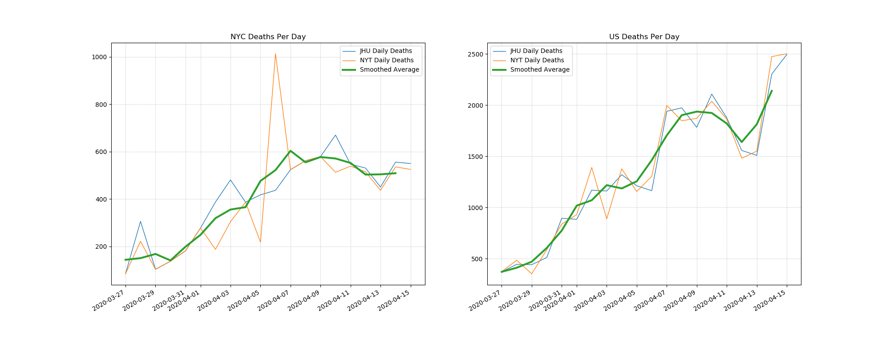

# Covid Plots
Plot deaths in the last 20 days in NYC and the US




I have become frustrated with coverage not showing the most important statistics of the corona virus response.
In my mind that is deaths per day in the US and NYC.

## Using this code
In a python interpretor with requests pandas and matplotlib.

```bash
python my_experiment.py
```

this will create `deaths_per_day.png` in your current working directory.

### More Details
If you want to run in a CI environment run `devtools/jenkins.sh`

```bash
#!/bin/bash
bash devtools/install.sh

export PATH=`pwd`/anaconda/bin:$PATH
source activate ml_starter

python my_experiment.py
```

